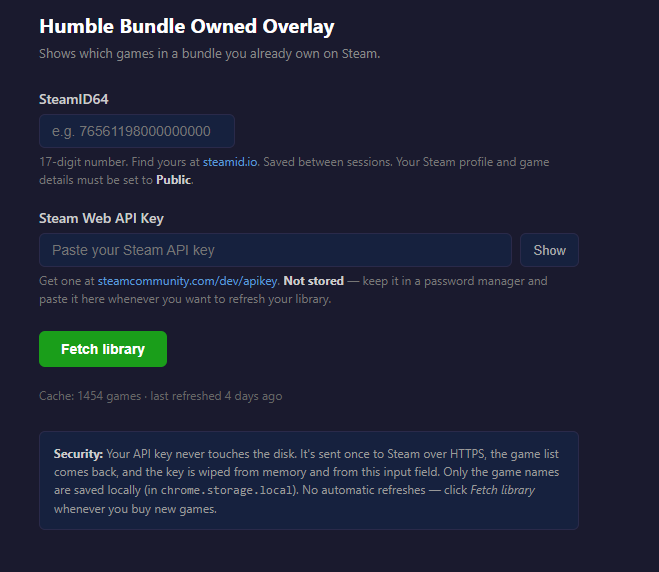
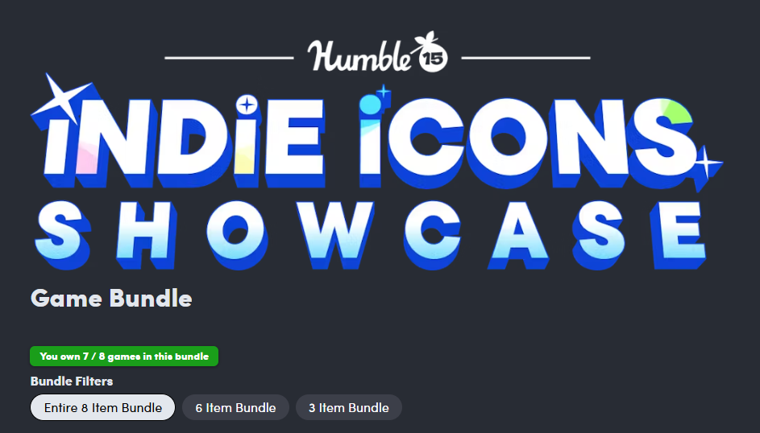
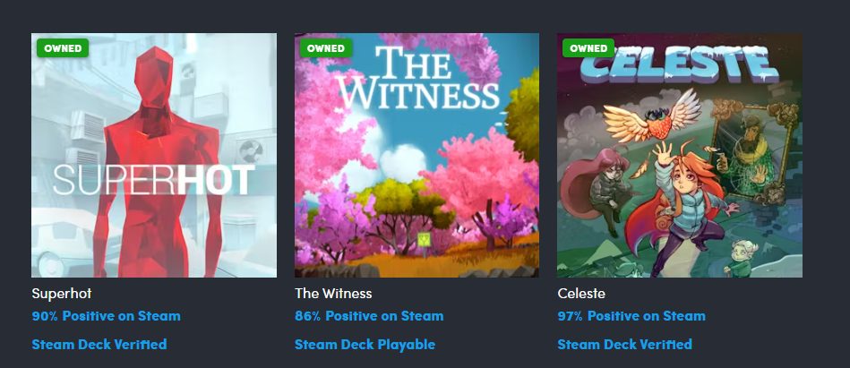

# Humble Bundle Owned Overlay

A personal Chrome extension that shows which games in a Humble Bundle you already own on Steam.

> **Disclaimer:** This extension was built collaboratively with [Claude](https://claude.com) for personal use and learning. I am not a software engineer. The code is published as-is — review it yourself before installing.

- Green **OWNED** badge on each game tile you already have
- "X / Y games owned" counter near the bundle title


## Screenshots

**Options page**



**Bundle overlay**



**Owned game badges**



## How it works

You set up a Steam Web API key + SteamID64 once. On the extension's options page, paste those and click **Fetch library** — the extension fetches your owned games from Steam, stores **only the game list** locally, and immediately discards the API key. Next time you want to refresh (after buying new games), you paste the key again.

On supported Humble game bundle and Humble Choice pages, each Steam game tile is matched against your owned games (by normalized title) and badged. Non-Steam Choice items, playtests, books, and software bundles are ignored.

## Setup

1. **Get a Steam Web API key** at https://steamcommunity.com/dev/apikey (domain can be `localhost`)
2. **Get your SteamID64** at https://steamid.io
3. **Make sure your Steam profile + Game details are set to Public** (Steam → Privacy → Game details = Public)

## Install

1. Download the ZIP from this repo (Code → Download ZIP) — or `git clone`
2. Extract to a stable folder
3. Chrome → `chrome://extensions` → enable **Developer mode** → **Load unpacked** → pick the folder
4. Right-click the extension → **Options** → paste your Steam API key + SteamID64 → click **Fetch library**

## Use

After the initial fetch, open any supported Humble game bundle or Humble Choice page — owned Steam games get a green badge.

Whenever you want to refresh (e.g. after buying new games), open the extension options, paste the key, click **Fetch library**.

## Security

- **API key is never written to disk.** It only exists in memory long enough to call Steam, then gets wiped from the input field. Keep the key in a password manager and paste it whenever you want to refresh.
- **SteamID64 is stored** between sessions (it's a public identifier — not sensitive).
- Only the resolved game list is persisted in `chrome.storage.local`.
- Host permissions: only `humblebundle.com` and `api.steampowered.com`.
- No analytics, no third parties, no remote code.

If you ever want to rotate the key, click **Revoke** at https://steamcommunity.com/dev/apikey and generate a new one.

## Files

```
manifest.json       # MV3 manifest, minimal permissions
background.js       # service worker — Steam API fetch + cache
content.js          # runs on humblebundle.com — DOM scan + badging
content.css         # badge + counter styling
options.html/.js    # settings page
lib/normalize.js    # title-normalization helper (edition suffixes, etc.)
```

## Versions

- **v3.3.3** — detect Humble Choice's plain `div` month headers and `.subhub-page` grid so the counter anchors above the real games panel
- **v3.3.2** — keep the Humble Choice counter in the page flow above the games grid instead of letting Humble's layout push it to the top-right
- **v3.3.1** — fix Humble Choice `/membership/home` by detecting Steam game cards in the logged-in claimed-games grid
- **v3.3.0** — add Humble Choice page support for Steam-delivered games only; ignore non-Steam Choice items and playtests
- **v3.2.0** — only run on game bundle pages; scope tile discovery to the tier container so cross-promo bundles aren't counted
- **v3.1.0** — restored to the proven-working v1.1 architecture after a few iterations went sideways
- **v3.0.x / v2.x** — experiments with session-based auth (never reliably worked, reverted)
- **v1.1.0** — don't persist Steam API key, manual-only refresh
- **v1.0.0** — initial release

## License

See [LICENSE](LICENSE).
